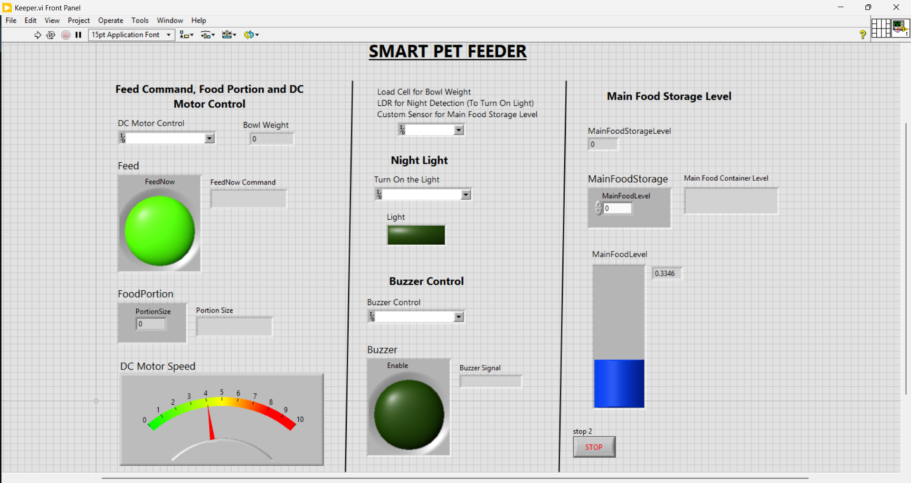
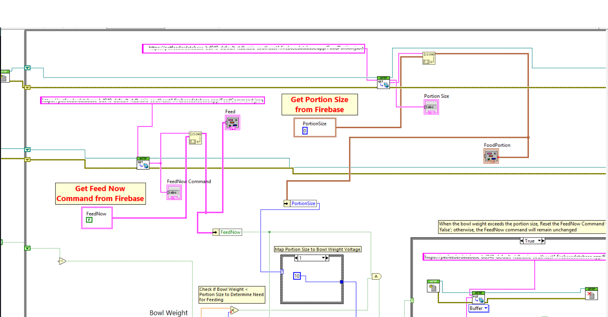
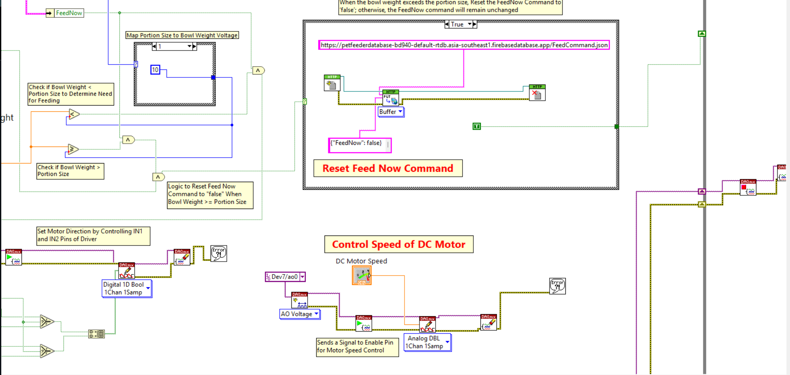
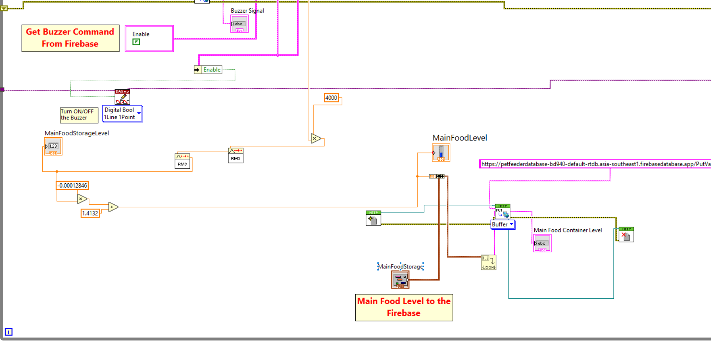

# **Keeper: The Smart Pet Feeder**

## **Introduction 🚀**
Many pet owners struggle with maintaining consistent feeding schedules for their pets due to busy lifestyles, travel, or unforeseen circumstances. Keeper is here to solve that problem by automating feeding routines, ensuring pets get the right amount of food at the right time.

This IoT-powered pet feeder offers **real-time monitoring**, **precision feeding**, and even **intruder alerts**. Additionally, we’re developing **AI-powered biometric recognition** for personalized pet care!

## **Features ✨**
- **Automated Feeding & Custom Scheduling**: Set meal times and portions remotely through the Android app.
- **Precision Portioning**: Uses an Archimedes screw and load cell mechanism to dispense accurate food portions.
- **Real-Time Monitoring**: Get updates on food levels and feeding status, plus **intruder alerts** when humans are detected near the feeder.
- **AI-Powered Features**: Pet detection with **YOLOv8** and biometric identification using **ResNet CNN** (in development).

## **Tech Stack 💻**

          
### **Software**

- **Android Studio (Java/Kotlin)** – Mobile app development.
- **YOLOv8** – Real-time pet and intruder detection.
- **ResNet CNN** – Biometric pet identification (under development).
- **Firebase** – Real-time data synchronization across the system.
- **LabVIEW** – Control logic and actuator interfacing.

### **Hardware**

- **Raspberry Pi**: Powers the pet detection system and controls the camera.
- **Load Cell**: Provides precise food portioning, ensuring the right amount of food is dispensed to the pet.
- **DC Motor with Archimedes Screw**: Dispenses food accurately based on portion sizes controlled by the mobile app.
- **LDR**: Measures background lighting and automatically powers an LED to assist the camera’s visibility during night-time or low-light conditions.
- **Custom-Level Sensor (LED + LDR Array)**: Custom-built sensor to measure food levels in storage, providing real-time feedback through the app.
- **Ultrasonic Sensor**: Detects when a pet or human is nearby, triggering the camera to capture images and send them to the Hugging Face AI model.

## **LabVIEW Control**

[**View the project slides on Canva**](https://www.canva.com/design/DAGtmpuYUc0/LGxgbsBoaLjTx6qRb8mZMQ/view?utm_content=DAGtmpuYUc0&utm_campaign=designshare&utm_medium=link2&utm_source=uniquelinks&utlId=h48197c4098)

LabVIEW processes all sensor inputs and actuators using the NI DAQmx, maintains the connection with the programmable DC power supply, and integrates a dashboard to monitor real-time data and system status.

<table style="width: 100%; border-collapse: collapse;">
  <tr>
    <td colspan="3" align="center" style="padding: 0;">
      
      
Dashboard displaying real-time food level, Motor control, and system status

    </td>
  </tr>
  <tr>
    <td style="padding: 5px; text-align: center;">
      
      
Portion control integration with Firebase.

    </td>
    <td style="padding: 5px; text-align: center;">
      
      
Connection with Motor Controller.

    </td>
    <td style="padding: 5px; text-align: center;">
      
      
Custom built level sensor.

    </td>
  </tr>
</table>

## **Getting Started 🚀**

To explore the project, please follow these steps:

1. **Set up Firebase**: Download and add the `google-services.json` file to your Android app directory.
2. **Install Python dependencies** for the Raspberry Pi using the provided `requirements.txt` file.
3. **Install LabVIEW** and the **NI DAQmx drivers** to interface with the sensors and actuators.
4. **Run the Android app** using Android Studio or directly on your device.

## **Future Work 🔮**

- **Multi-pet Support**: Allow the app to manage multiple pets with personalized feeding schedules.
- **Enhanced Biometric Identification**: Further development of ResNet CNN for precise pet identification.
- **Expanded Features**: Integrate additional sensors to monitor pet activity and health.

Feel free to reach out for questions or collaboration opportunities!
